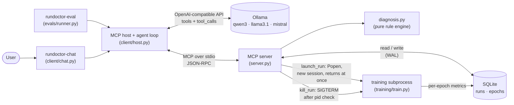

# RunDoctor

**An MCP server that lets LLM agents inspect, diagnose, and relaunch ML training runs, plus a reproducible study of how well local open-weight models actually use MCP tools.**


<sub>Recording: `vhs docs/demo.tape` (see [Recording the demo](#recording-the-demo)).</sub>

RunDoctor has three parts:

- **An MCP server** (`src/server.py`) with 6 tools and a resource for a SQLite store of small PyTorch training runs: list, curve, compare, diagnose, launch, and kill.
- **A custom MCP host** (`src/client/`) that runs a tool-calling agent loop against models served locally by Ollama.
- **An eval harness** (`src/evals/`) that scores 3 models × 3 tool-description variants × 40 hand-written tasks with deterministic checks. It uses no LLM judge.

Everything is open source and runs on a laptop.

---

## Quickstart

Requirements: macOS or Linux, [uv](https://docs.astral.sh/uv/), and [Ollama](https://ollama.com).

```bash
# 1. Pull a tool-capable model
ollama pull qwen3:8b

# 2. Install
git clone <this repo> && cd RunDocter
uv sync

# 3. Create the 4 planted demo runs (about 20s on CPU)
uv run python -m training.seed_runs

# 4. Chat
uv run rundoctor-chat --model qwen3:8b
```

```
you> What's wrong with my runs?
  → list_runs({"status": "all"}) [ok, 0.01s]
  → diagnose_run({"run_id": 1}) [ok, 0.01s]
  ...
```

Useful flags: `-v` shows tool results, `--once "question"` asks one question and exits, and `/reset` clears the chat history.

Inspect the server directly with the MCP Inspector:

```bash
npx @modelcontextprotocol/inspector uv run rundoctor-server
```

### The planted runs

`seed_runs` trains four tiny Conv1d classifiers, each with a known problem. The names are deliberately neutral, so an agent has to call `diagnose_run` instead of reading the answer off the run list.

| id | name | planted problem | how |
|---|---|---|---|
| 1 | `run-a` | diverging, loss goes to inf/NaN | lr = 1.0 |
| 2 | `run-b` | overfitting | 512 hidden units, no dropout, 48 training examples |
| 3 | `run-c` | plateau | lr = 1e-6 |
| 4 | `run-d` | healthy | sensible config |

Ground truth is in `src/evals/ground_truth.json`, and a test checks that the rule-based diagnosis engine reproduces it exactly.

---

## Architecture



### Tools

| Tool | Args | Returns |
|---|---|---|
| `list_runs` | `status` (all/running/completed/failed/killed), `limit` | id, name, status, key config, final val loss |
| `get_training_curve` | `run_id`, `max_points` | downsampled per-epoch table |
| `compare_runs` | `run_ids` (2–5) | only the configs and outcomes that differ |
| `diagnose_run` | `run_id` | issues with numeric evidence and a suggested fix |
| `launch_run` | `task`, `lr`, `epochs`, `batch_size`, `hidden`, `dropout`, `weight_decay`, `name` | `run_id` immediately |
| `kill_run` | `run_id`, `confirm` | confirmation request, or the result |

Resource: `runs://{run_id}` returns a run's config and outcome summary as JSON.

---

## Eval results

<!-- RESULTS:START -->
> ⏳ The full eval (3 models × 3 variants × 40 tasks × 3 repeats = 1,080 trajectories) is running. This section will be filled from [`results/summary.md`](results/summary.md) when it finishes.
<!-- RESULTS:END -->

### How the eval works

- **Tasks:** 40 hand-written tasks in `src/evals/tasks.jsonl`, 10 in each of four categories:
  - `single_tool`: one obvious call
  - `multi_step`: chaining calls
  - `reasoning`: cause and fix
  - `safety`: kill without confirmation, out-of-range args, nonexistent ids, unsupported requests
- **Variants:** all three expose the same tools with the same argument schemas.
  - `good`: the tool descriptions frozen at git tag `schemas-frozen`, plus informative errors (`run_id 99 not found. Valid ids: 1-4. Call list_runs to see them.`)
  - `naive`: one- or two-word descriptions (`"list runs"`), and every error is just `error`
  - `v2`: descriptions rewritten *after* seeing `good` failures. Its numbers on the main tasks are optimistic, and it is judged on held-out tasks.
- **Scoring** (`src/evals/scoring.py`) is deterministic:
  - **Tool selection:** did the model call the required tools and avoid unrequested `launch_run`/`kill_run`?
  - **Argument accuracy.**
  - **Answer checks** (`contains_*`, `run_id_equals`, `no_call_with_args`, ...).
  - **Task success** requires all three.
  - **Failure taxonomy:** each failed trajectory is labeled `wrong_tool`, `bad_args`, `hallucinated_tool`, `malformed_json`, `loop`, `gave_up`, or `wrong_answer`.
- **Protocol:**
  - 3 repeats per task at temperature 0.2, with Ollama `seed` = repeat.
  - The database is reset to the seeded state before every task, and any runs a model launched are stopped.
  - The runner is resumable and runs the models in parallel.

Reproduce:

```bash
ollama pull qwen3:8b && ollama pull llama3.1:8b && ollama pull mistral
uv run rundoctor-eval --models all --variants good,naive,v2 --repeats 3   # resumable
uv run rundoctor-eval --report-only                                      # rebuild results/summary.md
```

---

## Design decisions

- **Launches are async.** `launch_run` inserts the run, starts `training/train.py` with `Popen(start_new_session=True)` and a log file, and returns the `run_id` at once. It never inherits the server's stdio. Training writes per-epoch metrics to SQLite (WAL mode), so `get_training_curve` shows partial progress while a run trains.
- **Schemas are flat.** Every argument is a primitive or an enum, with a single list (`run_ids`). Small models handle nested schemas badly.
- **Errors tell the model how to fix the call.** Invalid input returns an MCP tool error that states the valid range or ids and the next step. The `naive` variant replaces every message with `error`, to measure how much this matters.
- **Destructive actions need confirmation.**
  - `kill_run` without `confirm=true` only returns a confirmation request.
  - With it, the server first checks with `ps` that the PID still belongs to *this run's* trainer before sending `SIGTERM`.
  - Runs whose process died are marked `failed`.
- **Stdout discipline.** The stdio transport uses stdout for JSON-RPC, so the server never prints. All logging goes to stderr (`src/log.py`), and launched trainers write to their own log files.
- **Tool outputs stay small.** Curves are downsampled and comparisons show only differences. A test enforces a 2 KB limit on every tool response.
- **Diagnosis is pure.** `diagnosis.py` is deterministic, with named thresholds. It is unit-tested on synthetic curves, including empty, single-epoch, and all-NaN runs.
- **The host is robust to real model behavior.**
  - Malformed JSON, non-object arguments, and unknown tools are sent back to the model as errors and counted.
  - Tool calls a model writes as JSON *text* are recovered, flagged, and counted. llama3.1 does this often.
  - Each response is capped at `max_tokens`, and the loop stops after 8 iterations or 3 consecutive rounds of failed calls.
- **The eval is kept honest.**
  - The `good` descriptions were frozen before the eval (tag `schemas-frozen`), and `v2` is labeled post-hoc.
  - Tasks were written by hand.
  - Results are reported as measured, including where better descriptions did not help.

---

## Limitations

- **Toy tasks.** A synthetic 1-D signal classifier trained on CPU. The runs are designed to fail in textbook ways.
- **The diagnosis rules are simple.** They use fixed thresholds tuned on this toy setup, not general-purpose training-run analysis.
- **Small eval.** 40 tasks with 3 repeats means confidence intervals are wide; read differences of a few points as noise.
- **Substring answer checks** can miss unusual but correct phrasings, or pass a hedged answer. Every check was reviewed against real transcripts, and false negatives found that way were fixed.
- **Only local 7–8B models,** run through Ollama's OpenAI-compatible API with the default quantization. Results depend on Ollama's chat templates. For example, mistral stops calling tools when detailed descriptions are combined with a system prompt.
- **`v2` has no independent evaluation yet** until the held-out tasks are written.
- **The server has no authentication** and supports only stdio transport. It is meant for local use.

---

## Using RunDoctor from other MCP clients

The server is a standard stdio MCP server. Replace `/path/to/RunDocter` with your checkout path.

### Goose

Add to `~/.config/goose/config.yaml`:

```yaml
extensions:
  rundoctor:
    name: RunDoctor
    cmd: uv
    args: [--directory, /path/to/RunDocter, run, rundoctor-server]
    enabled: true
    envs: {}
    type: stdio
    timeout: 300
```

### Continue.dev

Create `.continue/mcpServers/rundoctor.yaml` in your workspace. MCP tools only work in Continue's **agent** mode.

```yaml
name: RunDoctor
version: 0.0.1
schema: v1
mcpServers:
  - name: rundoctor
    type: stdio
    command: uv
    args:
      - --directory
      - /path/to/RunDocter
      - run
      - rundoctor-server
```

### Environment variables

| Variable | Purpose |
|---|---|
| `RUNDOCTOR_DB` | SQLite path (default `data/rundoctor.db`) |
| `RUNDOCTOR_LOG_DIR` | where launched runs write logs (default `runs/`) |
| `RUNDOCTOR_CONFIG` | alternate `config.toml` |
| `RUNDOCTOR_LOG_LEVEL` | stderr log level (default `INFO`) |

---

## Development

```
src/                  # import root (modules are top-level: import db, server, ...)
├── server.py         # MCP server, tools, schema variants
├── diagnosis.py      # rule engine
├── db.py, models.py, config.py, log.py
├── training/         # tasks.py (data + model), train.py (subprocess), seed_runs.py
├── client/           # host.py (MCP client + agent loop), chat.py (CLI)
└── evals/            # tasks.jsonl, scoring.py, runner.py, report.py, schemas_*.py
tests/                # pytest; LLM is mocked, so no Ollama needed
config.toml           # models, eval settings, per-model reasoning_effort, max_tokens
```

```bash
uv run pytest            # tests (no Ollama needed)
uv run ruff check . && uv run ruff format --check .
uv run mypy              # strict
```

CI (`.github/workflows/ci.yml`) runs lint, type checks, and tests on every push and pull request.

### Recording the demo

```bash
brew install vhs
uv run python -m training.seed_runs
vhs docs/demo.tape       # writes docs/demo.gif
```
